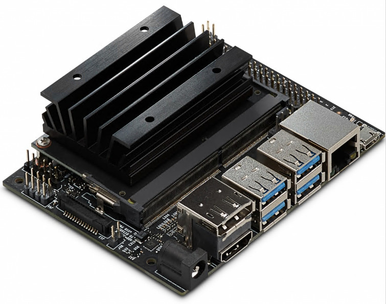
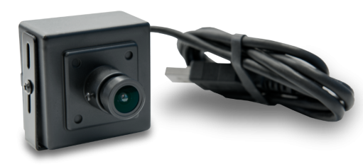

# Lab 1: Set up Jetson Nano

# 1. Prerequisites:

- Jetson Nano 4G:

    
	
- Power Supply:
	- Use a 5V 4A Power Supply with 2.1mm DC barrel connector
	- Use a 2-pin Jumper on J48.

    


- USB Webcam:
	-  Use Up2 USB webcam

    

- CSI Webcam:	
	-  Use Raspberry Pi camera module

    
	


# 2. Change swap file size to 4GB

## 2.1 Show the existing swap file size.

```
free -m
```


## 2.2 Disable ZRAM

```
sudo systemctl disable nvzramconfig
```

## 2.3 Create 4GB swap file

```
sudo fallocate -1 4G /mnt/4GB.swap
sudo chmod 600 /mnt/4GB.swap
sudo mkswap /mnt/4GB.swap
```


## 2.4 Append the following line to /etc/fstab

```
sudo su
Echo "/mnt/4GB.swap swap swap defaults 0 0" >> /etc/fstab
Exit
```


## 2.5 Reboot

```
sudo reboot
```

## 2.6 Verify the swap file size

Once rebooted, check the swap file size again.

```
free -m
```	
	
	

# 3. Verify the USB webcam
	
## 3.1 Check the available USB devices

Connect the USB Webcam and run below command to list all the USB devices.

```
lsusb
```


	
## 3.2 List the video device

```
ls -ltrh /dev/video*
```


## 3.3 Test using nvgstcapture

https://developer.nvidia.com/embedded/learn/tutorials/first-picture-csi-usb-camera

Nvgstcapture is installed. On Jetson Nano command line, run below:

```
nvgstcapture-1.0 --help
nvgstcapture-1.0 --camsrc=0 --cap-dev-node=0
```	


# 4. Download docker
	
## 4.1 Create a data directory.

```
mkdir -p nvdli-data
```	

## 4.2 Create a reusable script.

```
echo "sudo docker run --runtime nvidia -it --rm --network host \
	    --volume ~/nvdli-data:/nvdli-nano/data \
	    --device /dev/video0 \
	    nvcr.io/nvidia/dli/dli-nano-ai:v2.0.2-r32.7.1" > docker_dli_run.sh
```

	
## 4.3 Make the script executable.

```
chmod +x docker_dli_run.sh
```
	
## 4.4 Run the script.

```
./docker_dli_run.sh
```

	

## 4.5 Get into the container.


	
# 5. Log into the JupyterLab Server

You may log into the JupyterLab server from local or from remote PC:

Use web browser to open below link:

http://192.168.50.48:8888/

Password: `dlinano`
	


	
	
`<END of Lab1>`	
	
