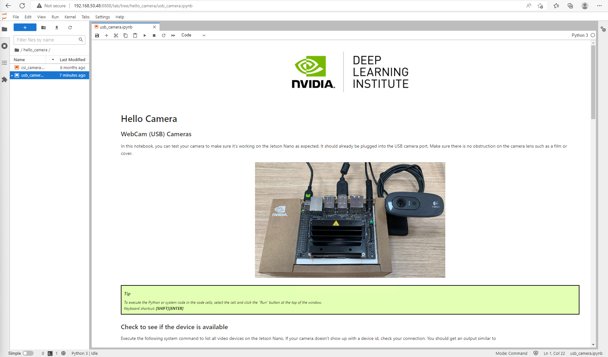

# Lab 2: Run Hello Camera app

This lab is running with Jupyter Notebook.

# Prerequisites:
- Lab 1 is completed.


# 1. Use usb_camera jupyter notebook
Open the `/hello_camera/usb_camera.ipynb` from the directory.




# 2. Check to see if the USB device is available
Run below linux command to check. Be sure to use "!" before the linux command in Jupyter Notebook.

```
!ls -ltrh /dev/video*
```


	
# 3. Create the camera project

Import the USBCamera class from the library.

```
from jetcam.usb_camera import USBCamera

#TODO change capture_device if incorrect for your system
camera = USBCamera(width=224, height=224, capture_width=640, capture_height=480, capture_device=0)

image = camera.read()
print(image.shape)

print(camera.value.shape)
```


	
# 4. Create a widget to view the image stream

Create a widget to display the image. Convert it from big8 format to jpeg to display.

```
import ipywidgets
from IPython.display import display
from jetcam.utils import bgr8_to_jpeg

image_widget = ipywidgets.Image(format='jpeg')

image_widget.value = bgr8_to_jpeg(image)

display(image_widget)

##########################
camera.running = True

def update_image(change):
    image = change['new']
    image_widget.value = bgr8_to_jpeg(image)
    
camera.observe(update_image, names='value')

#############################
camera.unobserve(update_image, names='value')
```


# 5. Another way to view the image stream

Use traitlets dlink method to connect the camera to the widget, using a transform as one of the parameters.

```
import traitlets
camera_link = traitlets.dlink((camera, 'value'), (image_widget, 'value'), transform=bgr8_to_jpeg)

camera_link.unlink()
camera_link.link()
```


# 6. Shutdown the camera to release the camera resource

```
import os
os._exit(00)
```


`<END of Lab2>`

	
