# Lab 3: Recognize Thumb up and down using Image Classifiaction

# Prerequisites
- Lab 1, 2 are completed.

# 1. Use usb_camera jupyter notebook
Open the `/hello_camera/usb_camera.ipynb` from the directory.


Create a USB camera and set it to running. 

```
from jetcam.usb_camera import USBCamera
from jetcam.csi_camera import CSICamera

# for USB Camera (Logitech C270 webcam), uncomment the following line
camera = USBCamera(width=224, height=224, capture_device=0) # confirm the capture_device number

# for CSI Camera (Raspberry Pi Camera Module V2), uncomment the following line
# camera = CSICamera(width=224, height=224, capture_device=0) # confirm the capture_device number

camera.running = True
print("camera created")
```
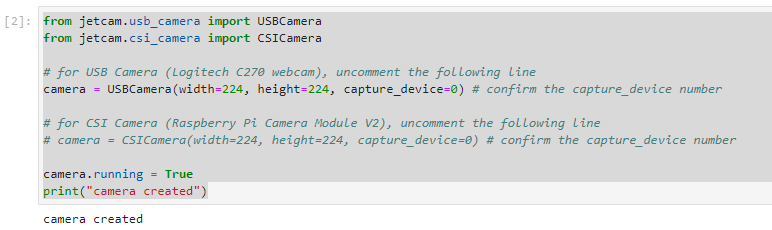

After running, you will notice the Camera is ON.


# 2. Define project Task and Categories of data

Define a thumbs task with `['thumbs_up', 'thumbs_down']` categories.

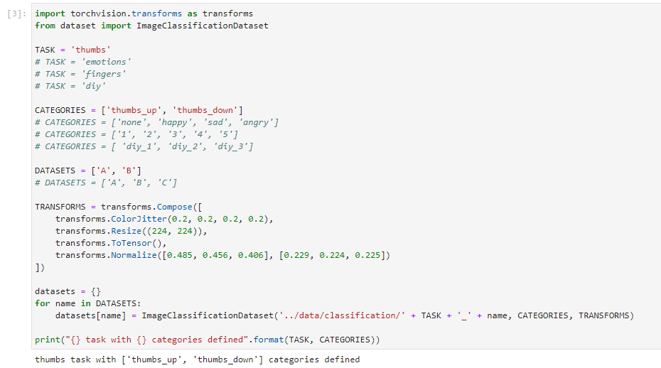

Set up the data directory location if not there already.

```
DATA_DIR = '/nvdli-nano/data/classification/'
!mkdir -p {DATA_DIR}
```

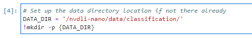


Check the directory created in the container.

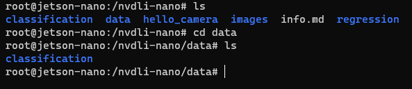


# 3. Create Data collection Widget

Create the data collection tool widget.

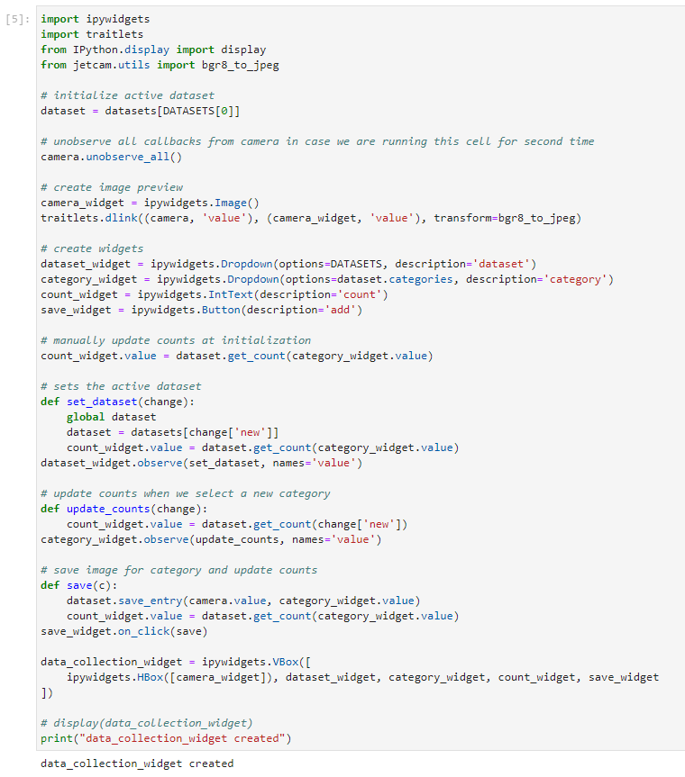


# 4. Define Model

Define the neural network and adjust the fully connected layer (fc) to match the outputs required for the project.

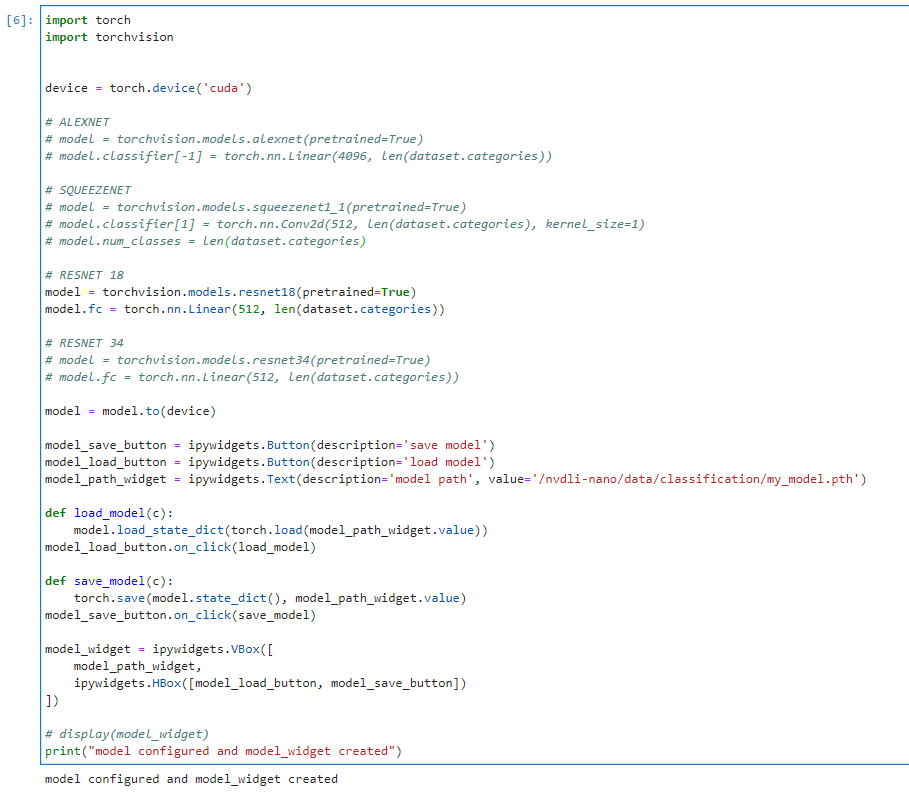


# 5. Live Execution

Set up the live execution widget.

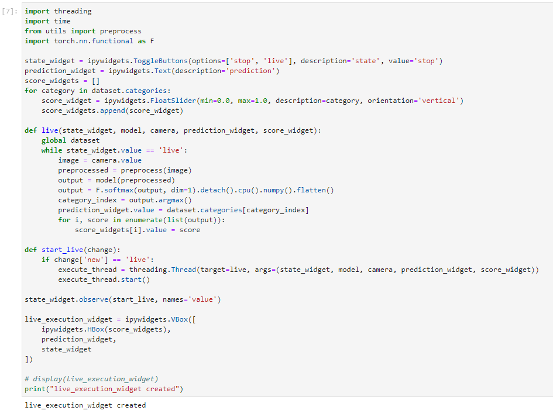


# 6. Training and evaluation

Define the trainer and the widget to control it.

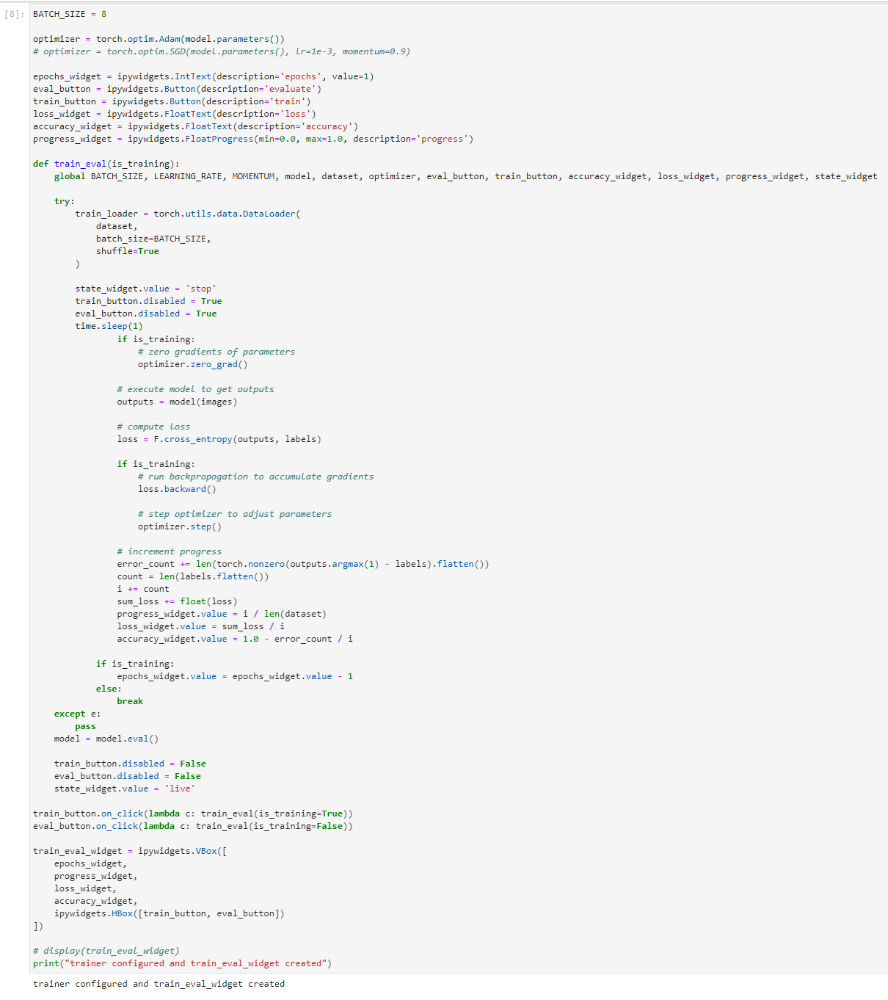


# 7. Display the Interactive Tool

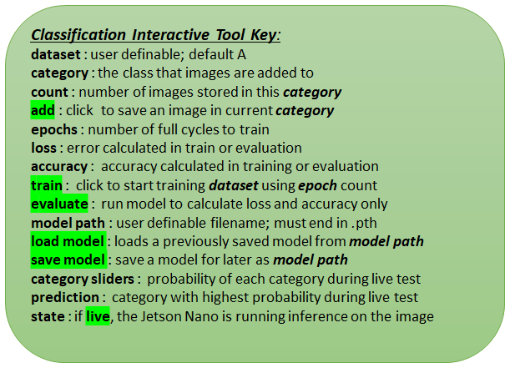

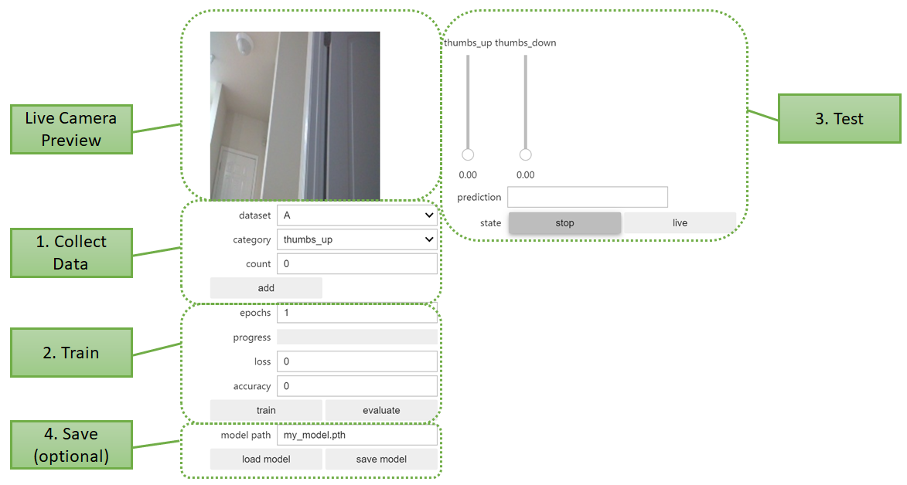


# 8. Combine all the widget into one display
	
## 8.1 Find a background for train

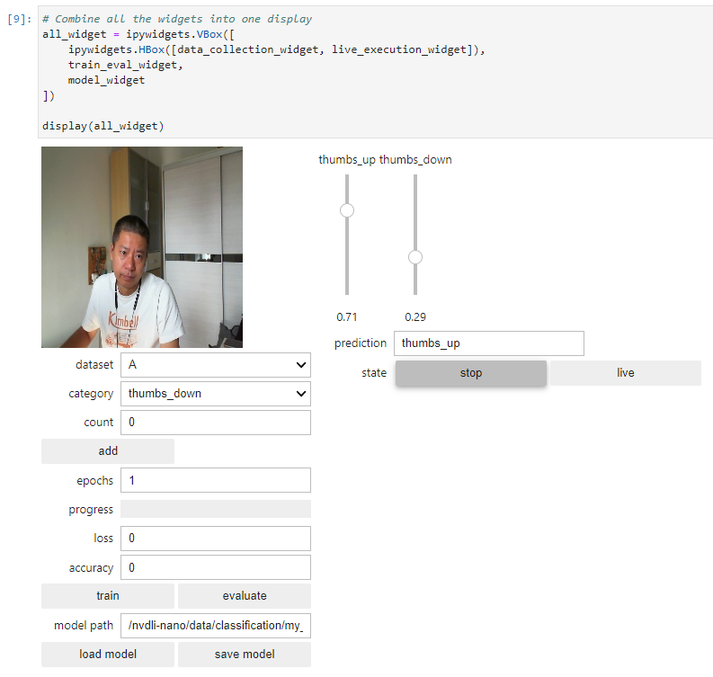


## 8.2 Add data for dataset A
First, add thumbs_up with 15, thumbs_down with 15, and then change epochs to 10 to run the training.

Then, try a few predictiAons. If some gestures cannot be recognized well, add a few pictures in the dataset and retain with 5 epochs.

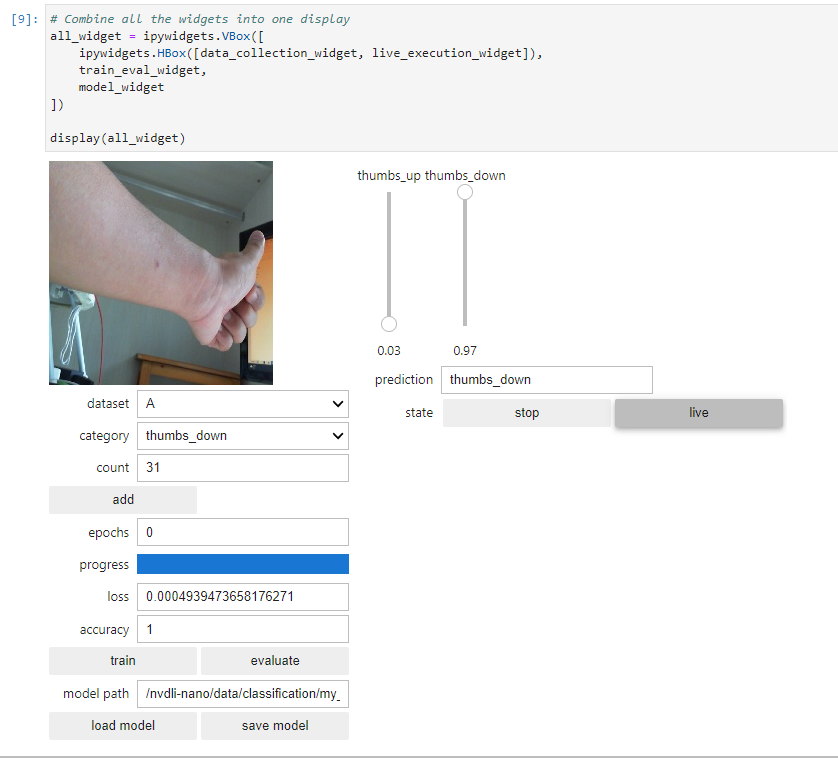


For example, in above picture, the thumbs_up is recognized as thumbs_down. We can add a few more pictures to train so as to fix this error.

Added 6 pictures in the thumbs_up dataset and train with 5 epochs. 

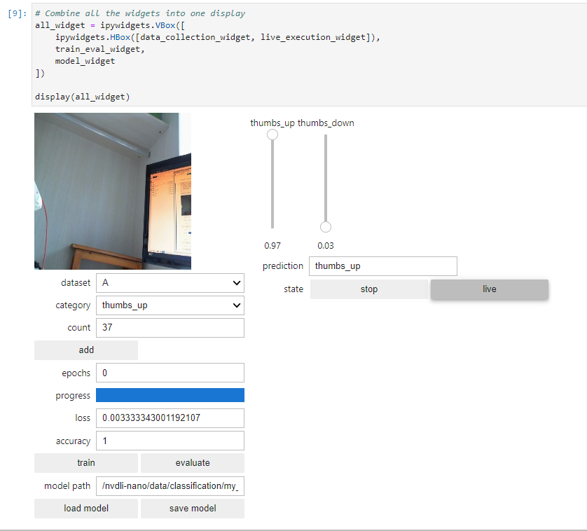


Now we can give a try with the same gesture and you can see it is predicted correctly.

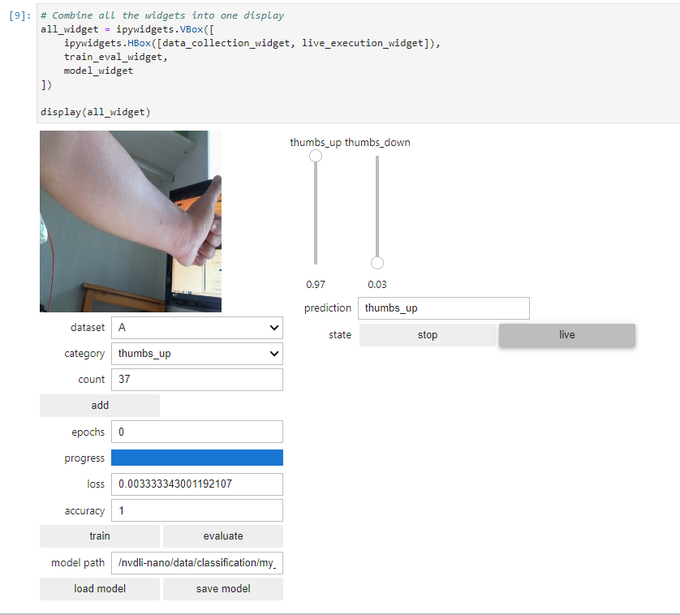


You may go ahead to verify. 


# 9. Shutdown the camera and notebook kernel

This is to release the camera resource.

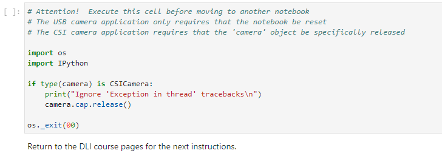

`<END of Lab3>`