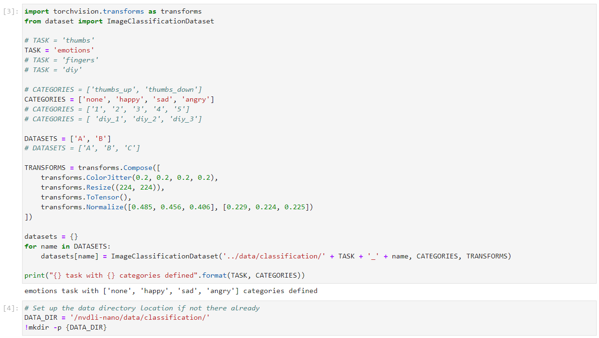
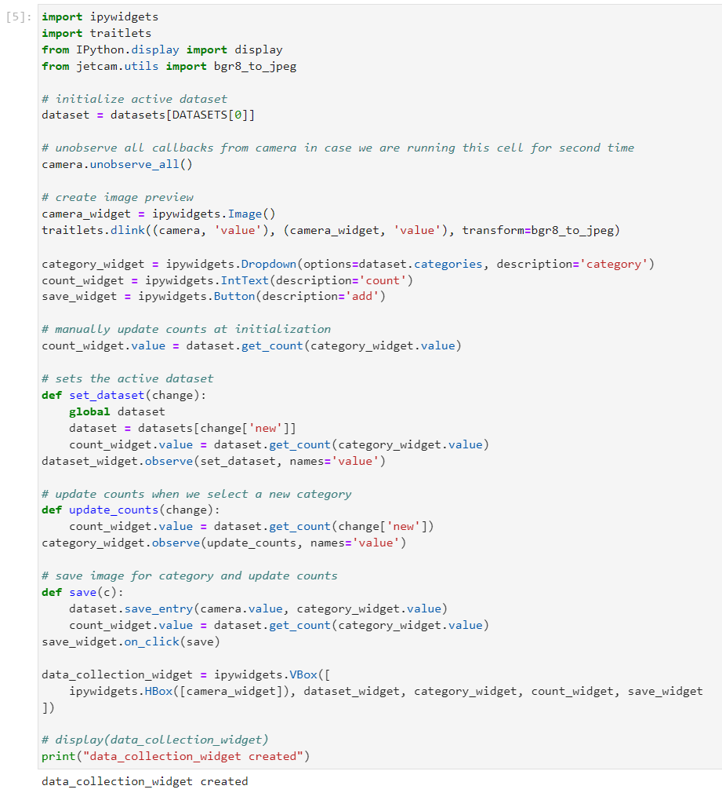
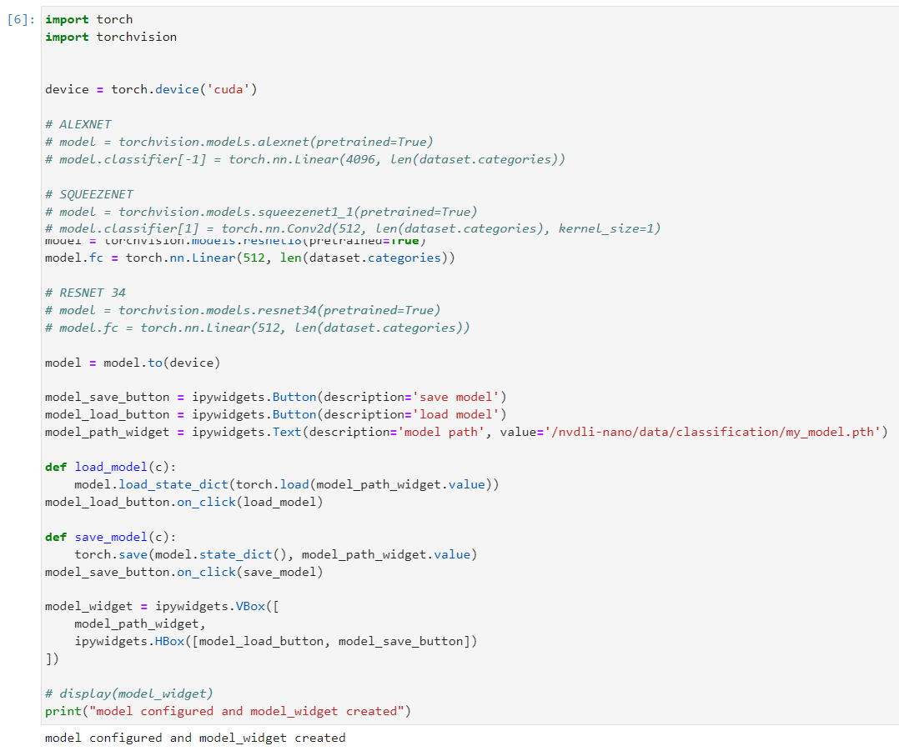
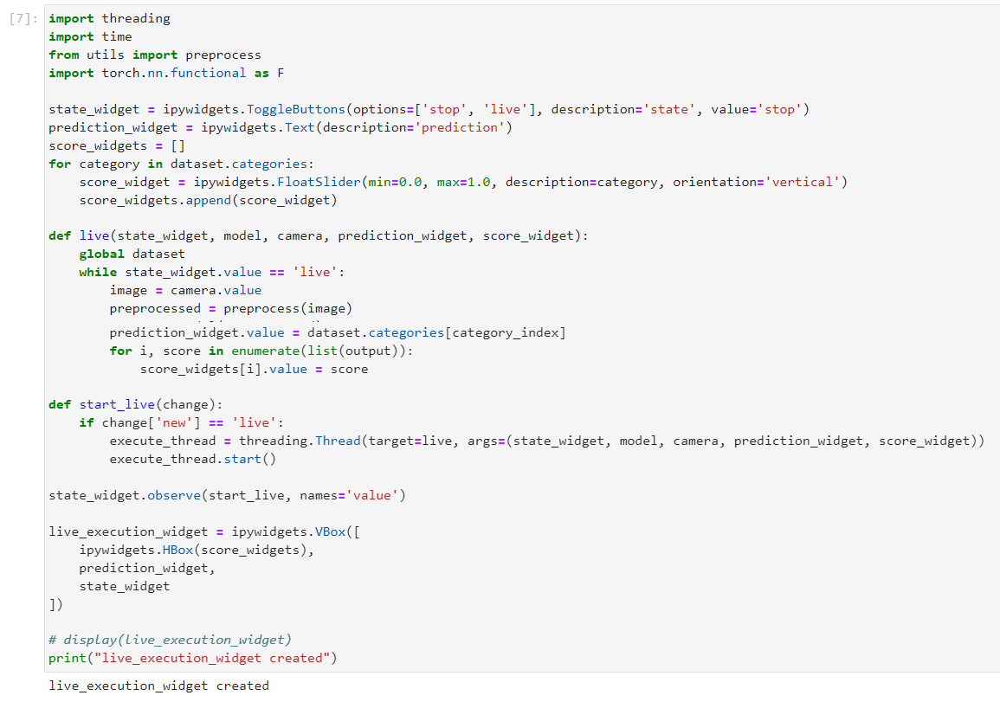
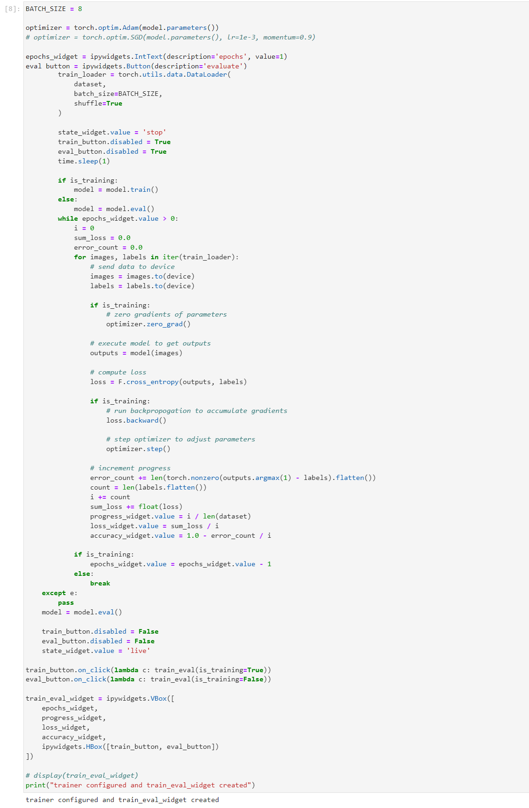
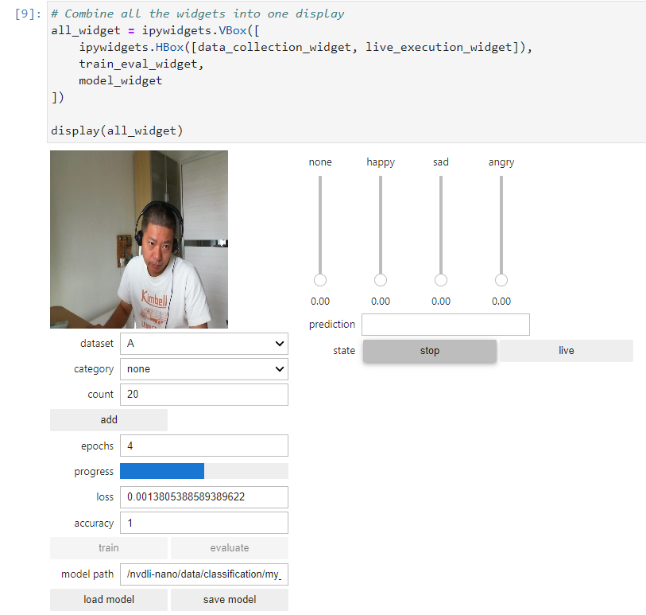
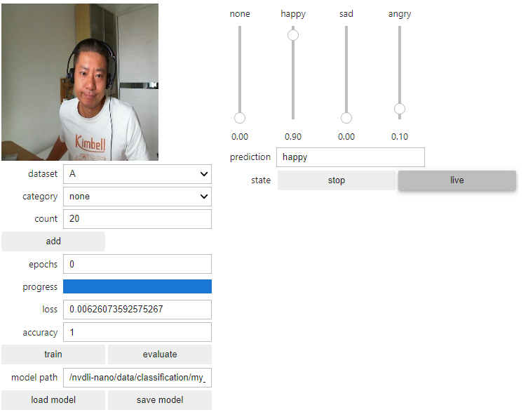
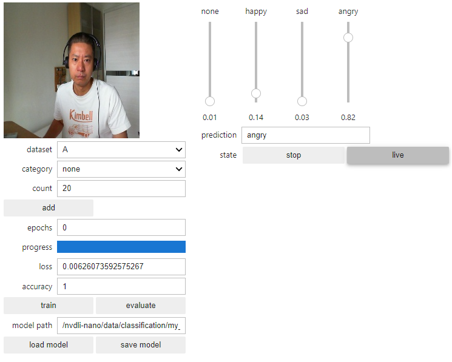
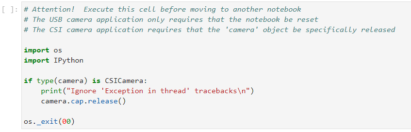

# Lab 4: Detect Emotions using Image Classfication

# Prerequisites:
- Lab 1, 2 are completed


# 1. Reuse the image classification interactive notebook

Duplicate the `classification_interactive.ipynb` and rename it to `classification_interactive_motion.ipynb`.

# 2. Use the USB camera and create the camera


# 3. Modify the Task Code Cell

Comment out the 'thumbs' project parameters and uncomment the 'emotions' parameters.

```
# TASK = 'thumbs'
TASK = 'emotions'

# CATEGORIES = ['thumbs_up', 'thumbs_down']
CATEGORIES = ['none', 'happy', 'sad', 'angry']
```




# 4. Execute all of the codes blocks










# 5. Combine all the widgets into one display

Take 20 pictures as image input for each category:
	• Dataset-A
		○ Happy: 20
		○ Sad: 20
		○ Angry: 20
		○ None: 20
	• epochs: 10

Start to train.




# 6. Test the result




	


# 7. Save model - optional


# 8. Shut down the camera and/or notebook kernel to release the camera resource



`<END of Lab4>`


