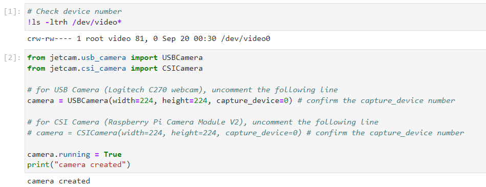
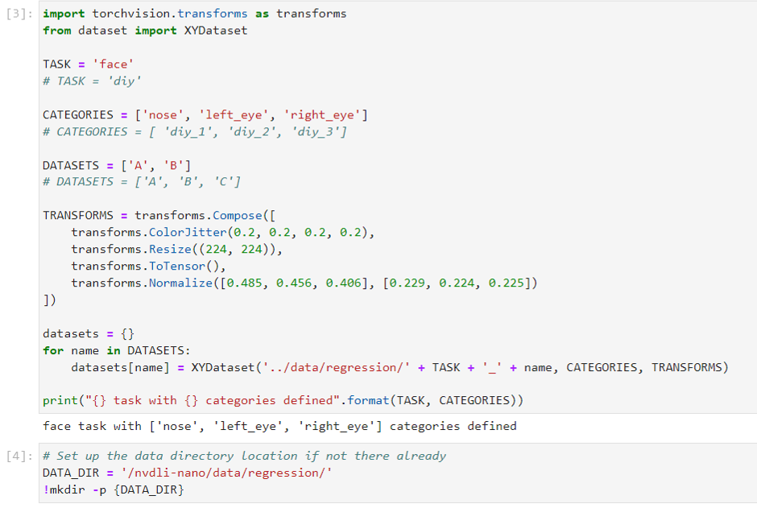
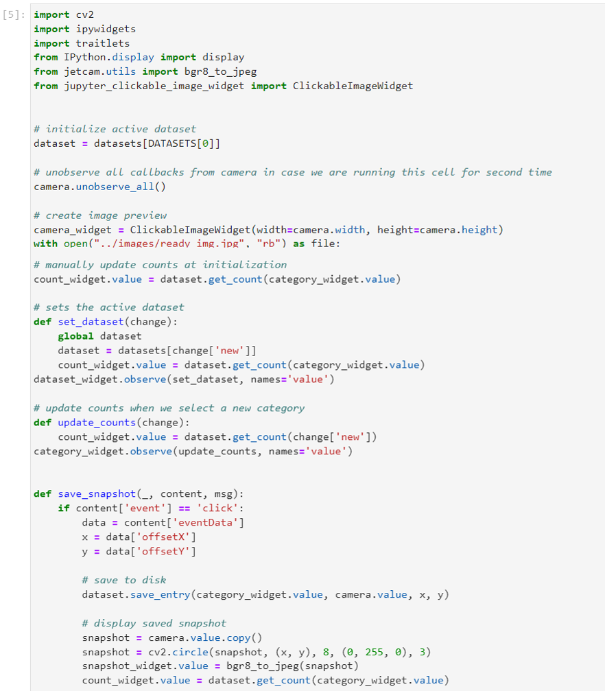
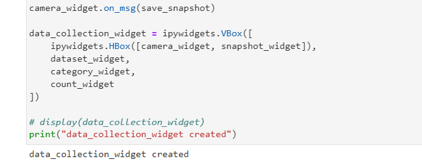
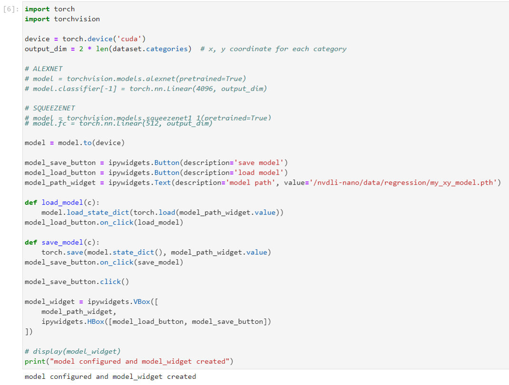
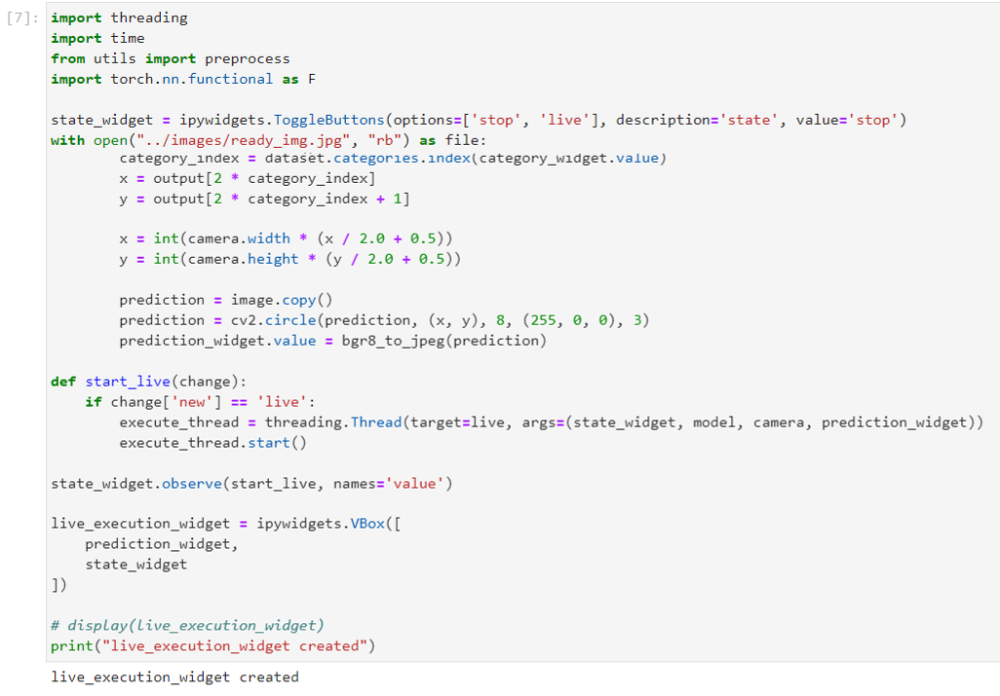
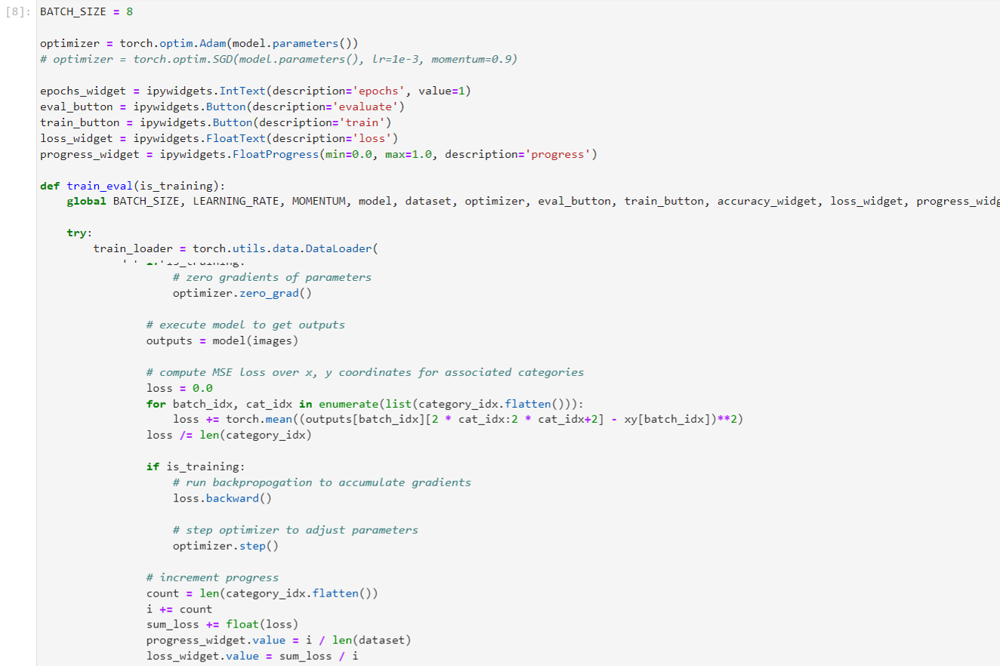
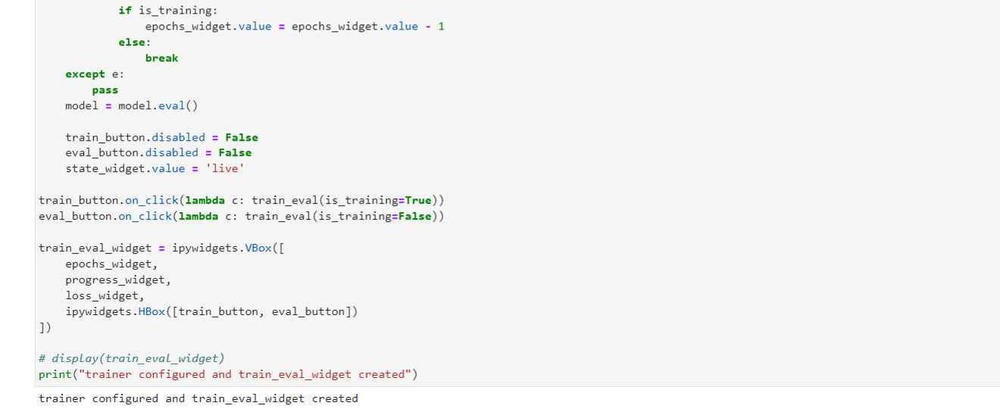
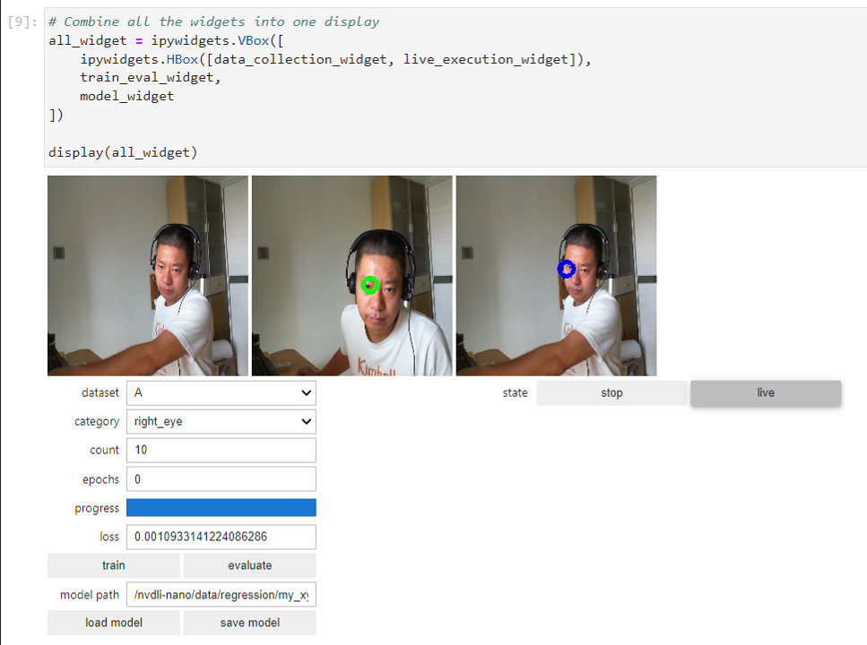
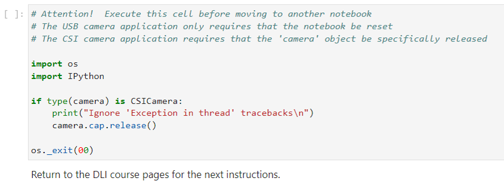

# Lab 5: Detect Face using Image Regression

# Prerequisites:
- Lab 1, 2 are completed.


# 1. Open the Jupyter notebook

Nvaigate to the `regression` folder in your JupyterLab and open the `regression_interactive.ipynb` notebook.


# 2. Execute all the codes blocks

This notebook is designed to be reusable for any XY regression task you wish to build. Step through the code blocks and execute them one at a time.


## 2.1 Create Camera




## 2.2 Define TASK and data CATEGORIES

You get to define your TASK and CATEGORIES parameters here, as well as how many datasets you want to track. For the Face XY Project, this has already been defined for you as the face task with categories of `nose`, `left_eye`, and `right_eye`. Each category for the XY regression tool will require both an X and Y values. 

Go ahead and execute the cell. Subdirectories for each category are created to store the example images you collect. The file names of the images will contain the XY coordinates that you tag the images with during the data collection step. This cell should only take a few seconds to execute.




## 2.3 Data collection

You'll collect images for your categories with a special clickable image widget set up in this cell. As you click the "nose" or "eye" in the live feed image, the data image filename is automatically annotated and saved using the X and Y oordinates from the click.







## 2.4 Model

The model is set to the same pre-trained ResNet18 model for this project:

model = torchvision.models.resnet18(pretrained=True)

For more information on available PyTorch pre-trained models, see the PyTorch documentation. In addition to choosing the model, the last layer of the model is modified to accept only the number of classes that we are training for. In the case of the Face XY Project, it is twice the number of categories, since each requires both X and Y coordinates (i.e. nose X, nose Y, left_eye X, right_eye X and right_eye Y).

```
output_dim = 2 * len(dataset.categories)
model.fc = torch.nn.Linear(512, output_dim)
```
This code cell may take several seconds to execute.




## 2.5 Live Execution

This code block sets up threading to run the model in the background so that you can view the live camera feed and visualize the model performance in real time. 

This cell should only take a few seconds to execute. For this project,a blue circle will overlay the model prediction for the location of the feature selected.




## 2.6 Training and evaluation

The training code cell sets the hyper-parameters for the model training (number of epochs, batch size, learning rate, momentum) and loads the images for training or evaluation. The regression version is very similar to the simple classification training, though the loss is calculated differently. The mean square error over the X and Y value errors is calculated and used as the loss for backpropagation in training to improve the model. This code cell may take several seconds to execute.






## 2.7 Display the interactive tool

This is the last code cell. All that's left to do is pack all the widgets into one comprehensive tool and display it. This cell may take several seconds to run and should display the full tool for you to work with. There are three image windows. Initially, only the left camera feed is populated. The middle window will display the most recent annotated snapshot image once you start collecting data. The right-most window will display the live prediction view once the model has been trained.




# 3. Collect data, train, test
	
Position the camera in front of your face and collect initial data. Point to the target feature with the mouse cursor that matches the category you've selected (such as the nose). Click to collect data. The annotated snapshot you just collected will appear in the middle display box. As you collect each image, vary your head position and pose:

	• Add 20 images of your nose with the nose category selected
	• Add 20 images of your left eye face with the left_eye category selected
	• Add 20 images of your right eye with the right_eye category selected

Set the number of epochs to 10 and click the train button

Once the training is complete, try the live view and observe the prediction. A blue circle should appear on the feature selected.


# 4. Improve your model

Use the live inference as a guide to improve your model! The live feed shows the model's prediction. As you move your head, does the target circle correctly follow your nose (or left_eye, right_eye)? If not, then click the correct location and add data. After you've added some data for a new scenario, train the model some more. For example:

Move the camera so that the face is closer. Is the performance of the predictor still good? If not, try adding some data for each category (10 each) and retrain (5 epochs). Does this help? You can experiment with more data and more training.

Move the camera to provide a different background. Is the performance of the predictor still good? If not, try adding some data for each category (10 each) and retrain (5 epochs). Does this help? You can experiment with more data and more training.

Are there any other scenarios you think the model might not perform well? Try them out!
Can you get a friend to try your model? Does it work the same? You know the drill: more data and training!


# 5. Save your model


# 6. Shut down the camera to release the camera resource




`<END of Lab6>`

