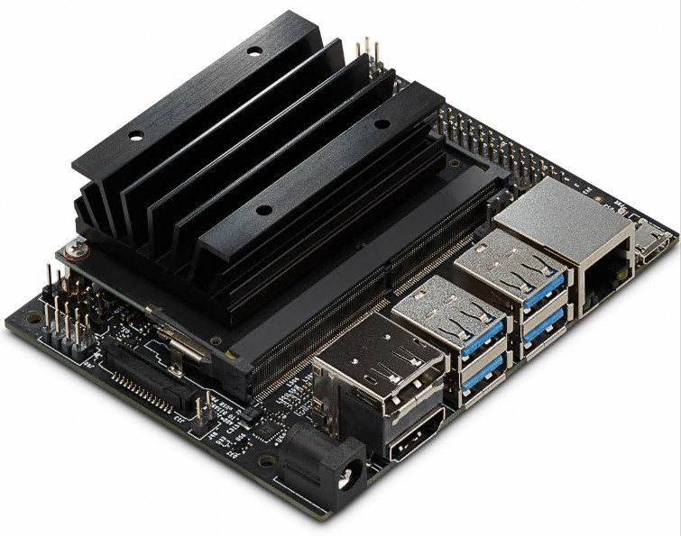
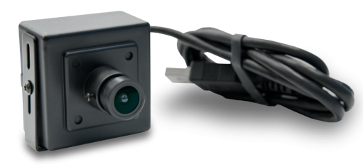
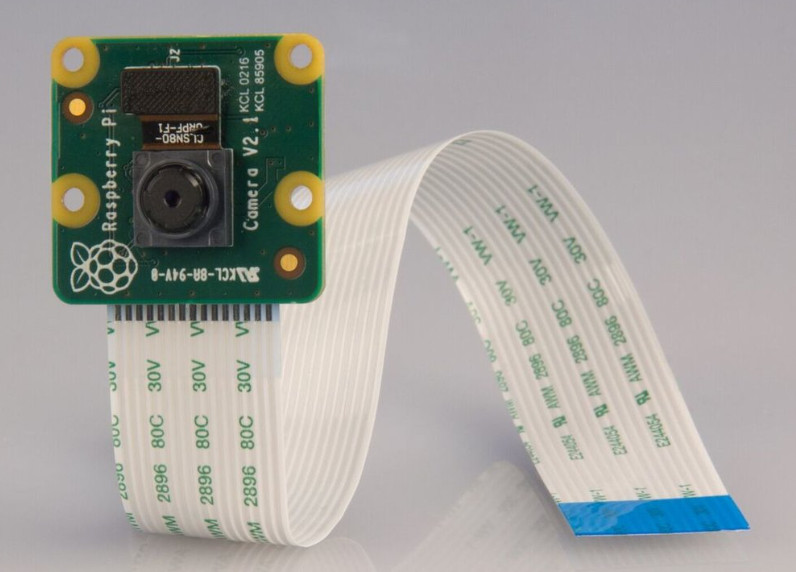

# README

This series of labs are to use webcams on Jetson Nano 4G to do image classifiation and regression.

Jetson Nano supports two types of webcams: USB Webcam and CSI Webcam.

- For USB Webcam, I'll use Microsoft Live Cam.

- For CSI Webcam, I'll use Raspberry Pi camera.

I will use the USB Webcam in the labs.

Here is an index of the labs I created.

## [Lab 1: Set up Jeston Nano](Lab1-Set_up_Jetson-Nano.md)
## [Lab 2: Run Hello Camera](Lab2-Run_Hello_Camera.md)
## [Lab 3: Detect Thumbs using Classification](Lab3-Recognize_Thumb_using_Image_Classification.md)
## [Lab 4: Detect Emotions using Classification](Lab4-Detect_Emotions_using_Image_Classfication.md)
## [Lab 5: Detect Face using Regrtession](Lab5-Detect%20_Face_using_Image_Regression.md)

`<END of README>`

